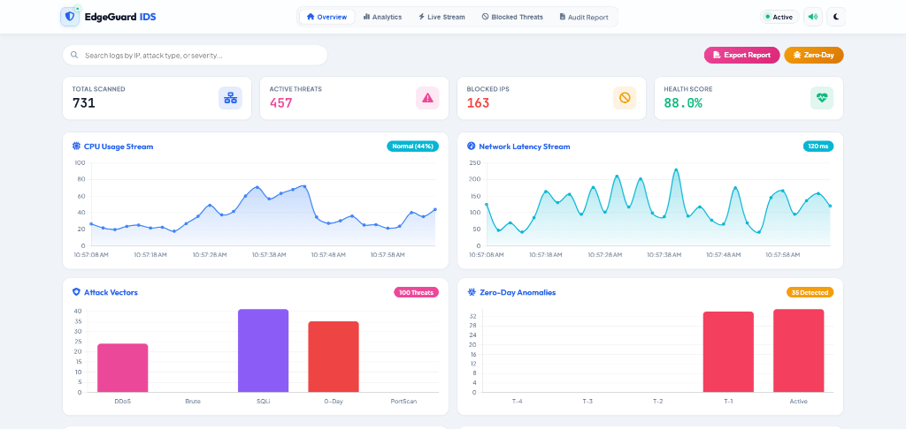
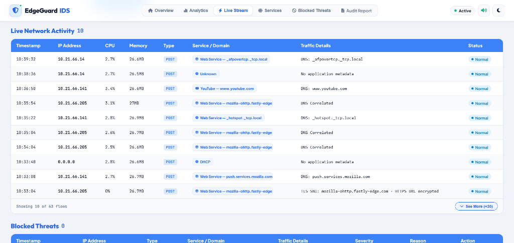
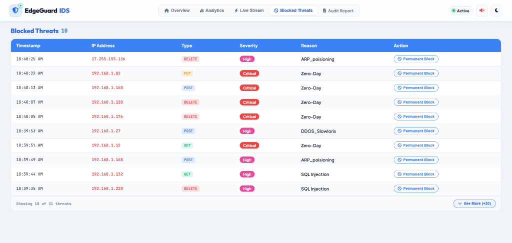
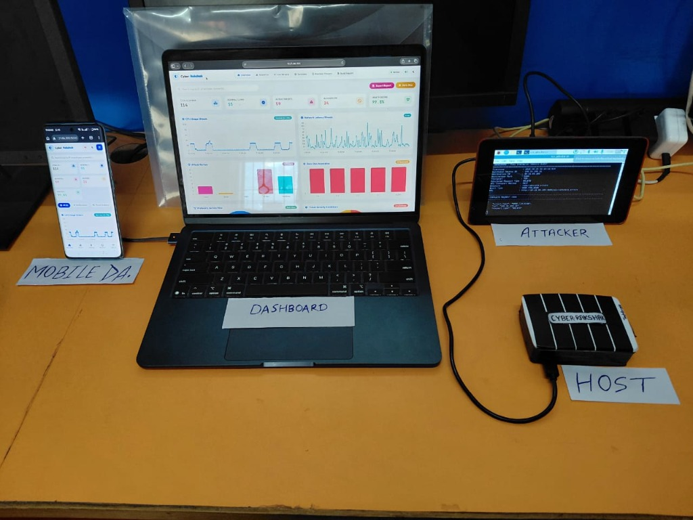

<div align="center">

<br>
<table align="center" style="border: none; background: transparent;">
  <tr>
    <td bgcolor="#ffffff" align="center" style="background: #ffffff; border-radius: 16px; padding: 20px 36px; border: 1px solid #e1e4e8; box-shadow: 0 4px 20px rgba(0,0,0,0.15);">
      
    </td>
  </tr>
</table>
<br>

<!-- Tech Stack Badges -->
<p align="center">
  
  
  
  
  
  
</p>

<!-- Live Metric Badges -->
<p align="center">
  
  
  
  
  
</p>

<p align="center">
  <b>An AI-powered, plug-and-play intrusion detection and autonomous mitigation appliance engineered for edge devices, smart campuses, defense outposts, and IoT infrastructures.</b>
</p>

<p align="center">
  <a href="#-quick-start"><b>⚡ Quick Start</b></a> •
  <a href="#-system-architecture"><b>🏗️ Architecture</b></a> •
  <a href="#-ui-showcase--dashboard"><b>📊 Live UI</b></a> •
  <a href="#-machine-learning-pipeline"><b>🧠 ML Engine</b></a> •
  <a href="#-penetration-testing--qa"><b>🧪 QA Tools</b></a> •
  <a href="#-rest-api-documentation"><b>🔌 REST API</b></a>
</p>

</div>

---

## 🛡️ Executive Overview

**Cyber Rakshak** is a high-speed, lightweight **Intrusion Detection and Prevention System (IDS/IPS)** designed to run entirely on resource-constrained hardware such as the **Raspberry Pi 4 (4GB)** or dedicated edge gateways. 

Placed inline between the **gateway router and internal switch**, Cyber Rakshak passively inspects bidirectional packet flows, extracts 10 statistical flow features in real-time, predicts threat signatures via a **hybrid XGBoost + Random Forest ensemble**, and instantly neutralizes malicious IP actors via native `iptables` firewall rules within **<500 milliseconds**.

### ⚡ Why Cyber Rakshak?
- 🔒 **100% Air-Gapped / Zero-Cloud**: No packet payloads or threat telemetry leave the premises.
- ⚡ **Autonomous Threat Neutralization**: Sub-second packet-to-firewall auto-block response.
- 📡 **LoRa SX1262 Long-Range Telemetry**: Up to 15km wireless alerts for remote rural/defense deployments.
- 📊 **Cyberpunk Dark Glassmorphism UI**: Real-time Chart.js telemetry with instant threat simulation.
- 📋 **Automated Audit Reports**: 1-click JSON/CSV incident logs with cryptographically verified audit IDs.

---

## 📊 UI Showcase & Dashboard

<div align="center">

### 🖥️ Main Real-Time Threat Matrix & Resource Monitor


<br/><br/>

| 📡 Live Packet Stream | 🚫 Auto-Blocked Threat Log |
|:---:|:---:|
|  |  |
| *Real-time packet inspection with CPU/RAM metrics* | *Autonomous IP blacklisting & manual override* |

<br/>

### 📦 Live Hardware & Multi-Device Deployment Setup


*Complete edge defense testbed: Laptop Dashboard, Mobile DA Telemetry, Attacker node, and Cyber Rakshak Host device.*

</div>

---

## 🏗️ System Architecture

<div align="center">

```
  ┌───────────────────────┐
  │   🌐 World Wide Web   │
  └───────────┬───────────┘
              │  (Untrusted Ingress)
              ▼
  ┌───────────────────────┐
  │   📡 Gateway Router   │
  └───────────┬───────────┘
              │  (Raw Traffic Bridge)
              ▼
┌─────────────────────────────────────────────────────────────────────────────┐
│                       🔒 CYBER RAKSHAK EDGE APPLIANCE                       │
│                         (Raspberry Pi 4 / Edge Host)                        │
│                                                                             │
│   ┌────────────────────────┐      ┌─────────────────────────────────────┐   │
│   │ ⚡ Flow Feature Engine  │ ───▶ │ 🧠 Hybrid ML Inference Pipeline     │   │
│   │ • 10 Statistical Feats │      │ • XGBoost Classifier (Primary)      │   │
│   │ • Sub-second Latency   │      │ • Random Forest Fallback Ensemble   │   │
│   └────────────────────────┘      └──────────────────┬──────────────────┘   │
│                                                      │                      │
│                                                      ▼                      │
│   ┌────────────────────────┐      ┌─────────────────────────────────────┐   │
│   │ 📊 Flask Web Console   │ ◀─── │ 🛡️ Active Threat Mitigation Engine │   │
│   │ • Dark Neon UI & Charts│      │ • Dynamic iptables DROP Rules       │   │
│   │ • Audit Report Gen     │      │ • Blacklist Manager (<500ms Block)  │   │
│   └────────────────────────┘      └─────────────────────────────────────┘   │
│                                                      │                      │
│                                                      ▼                      │
│                                   ┌─────────────────────────────────────┐   │
│                                   │ 📡 LoRa SX1262 / SMS / Email Alerts │   │
│                                   └─────────────────────────────────────┘   │
└─────────────────────────────────────┬───────────────────────────────────────┘
                                      │  (Clean, Verified Egress)
                                      ▼
                          ┌───────────────────────┐
                          │   🔀 Managed Switch   │
                          └───────────┬───────────┘
                                      │
              ┌───────────────────────┼───────────────────────┐
              ▼                       ▼                       ▼
      💻 Workstations          📱 Smart Devices          🤖 IoT Sensors
```

</div>

---

## ⚙️ Technical Architecture Matrix

<div align="center">

| Module | Core Technology | Architectural Purpose |
|:---|:---|:---|
| **Edge Hardware** | Raspberry Pi 4 Model B (4GB RAM) | Standalone embedded bridge & packet classifier |
| **Machine Learning** | XGBoost 2.0 + Scikit-Learn 1.4 | High-precision multi-class anomaly categorization |
| **Web Server** | Flask 3.0 + Jinja2 + AJAX Polling | Real-time command center & live analytics telemetry |
| **Frontend UI** | Chart.js 4.4 + Modern Glassmorphism CSS | Responsive dark-mode dashboard & report visualizer |
| **Firewall Control**| Native Linux `iptables` + Blacklist Manager | Automated instant blocking of malicious IP flows |
| **Wireless Telemetry**| Semtech LoRa SX1262 UART Module | Long-range offline emergency alert broadcasting |
| **Alerting Dispatch**| Twilio REST API + Python smtplib (TLS) | Automated SMS & email threat alerts with RSA keys |

</div>

---

## 🧠 Machine Learning Pipeline

### 10 Engineered Statistical Flow Features

```
┌───────────────────────┬─────────────────────────────────────────────────────────┬──────────────┐
│ Feature Name          │ Description & Cyber Indicator                           │ Importance   │
├───────────────────────┼─────────────────────────────────────────────────────────┼──────────────┤
│ proto                 │ Transport protocol encoding (TCP=0, UDP=1, ICMP=2)      │ 🟡 Medium    │
│ service               │ Application service (HTTP, DNS, MQTT, SSL, SSH, DHCP)   │ 🟡 Medium    │
│ fwd_URG_flag_count    │ TCP Urgent flag count — Key indicator for SYN/DoS flood │ 🔴 High      │
│ fwd_pkts_payload.min  │ Minimum payload size in forward direction               │ 🔴 High      │
│ fwd_pkts_payload.avg  │ Mean payload byte size across inspected connection flow  │ 🔴 High      │
│ fwd_iat.max           │ Maximum packet inter-arrival time (Slowloris indicator) │ 🟡 Medium    │
│ idle.min              │ Minimum idle time before flow reactivation              │ 🟡 Medium    │
│ idle.avg              │ Average idle duration across session lifecycle          │ 🟡 Medium    │
│ fwd_init_window_size  │ Initial TCP receiver window size (Fingerprinting)       │ 🔴 High      │
│ fwd_last_window_size  │ Final TCP receiver window size                          │ 🔴 High      │
└───────────────────────┴─────────────────────────────────────────────────────────┴──────────────┘
```

### 📈 Edge Benchmark Performance

<div align="center">

| Metric | Raspberry Pi 4 (ARM Cortex-A72) | Reference x86 Host | Status |
|:---|:---:|:---:|:---:|
| **Classification Accuracy** | **98.6%** | 99.1% | 🟢 Optimal |
| **Precision / Recall** | **98.4% / 98.9%** | 98.9% / 99.3% | 🟢 Optimal |
| **Inference Latency** | **~450 ms** | ~85 ms | ⚡ Sub-Second |
| **Memory Footprint** | **~310 MB** | ~520 MB | 🟢 Ultra-Light |
| **Power Consumption** | **5.1 W** | 45.0 W | 🔋 Eco-Friendly |

</div>

---

## 🎯 Threat Detection & Mitigation Coverage

Cyber Rakshak classifies and actively neutralizes **12 attack vectors**:

<div align="center">

| Attack Category | Threat Signature | Severity | Defense Action |
|:---|:---|:---:|:---|
| **Denial of Service** | `DDOS_Slowloris` | <span style="color:#ff007f">CRITICAL</span> | Instant `iptables DROP` & IP Blacklist |
| **Denial of Service** | `DOS_SYN_Hping` | <span style="color:#ff007f">CRITICAL</span> | Connection Terminate & Port Rate-Limit |
| **Credential Access** | `Metasploit_Brute_Force_SSH`| <span style="color:#ffb703">HIGH</span> | Auto-Quarantine & SMS Alert |
| **Web Attack** | `SQL Injection` | <span style="color:#ff007f">CRITICAL</span> | Request Reject & Audit Incident Log |
| **Reconnaissance** | `NMAP_TCP_scan` | <span style="color:#ffb703">HIGH</span> | Stealth Port Cloaking & Log Entry |
| **Reconnaissance** | `NMAP_UDP_SCAN` | <span style="color:#ffb703">HIGH</span> | UDP Drop & Source Blacklist |
| **Reconnaissance** | `NMAP_OS_DETECTION` | <span style="color:#00f0ff">MEDIUM</span> | TCP Fingerprint Obfuscation |
| **Reconnaissance** | `NMAP_FIN_SCAN` | <span style="color:#ffb703">HIGH</span> | Flag Sanitization & Source Flagging |
| **Reconnaissance** | `NMAP_XMAS_TREE_SCAN` | <span style="color:#ffb703">HIGH</span> | Malformed Packet Drop & Blacklist |
| **Man-In-The-Middle**| `ARP_poisioning` | <span style="color:#ff007f">CRITICAL</span> | ARP Table Lockdown & Broadcast Alert |
| **Zero-Day Vector** | `Zero-Day Anomaly Flow` | <span style="color:#ff007f">CRITICAL</span> | Dynamic Sandbox Isolation |
| **IoT Sensor Traffic**| `MQTT_Publish` / `Thing_Speak` | <span style="color:#00ff88">NORMAL</span> | Passthrough with Telemetry Indexing |

</div>

---

## 🧪 Penetration Testing & QA

All attack vector signatures were validated using industry-standard penetration toolchains in isolated testing sandboxes:

```bash
# 1. Simulate Distributed Denial of Service (SYN Flood)
hping3 -S -p 80 --flood --rand-source 127.0.0.1

# 2. Simulate SSH Brute Force Credential Exploit
hydra -l root -P rockyou.txt ssh://127.0.0.1 -t 16

# 3. Simulate Full Network Reconnaissance & Port Scanning
nmap -sS -sV -O -p 1-65535 -T4 127.0.0.1

# 4. Custom Multi-Vector Test Suite via Host Script
python Host/attacker.py
```

---

## ⚡ Quick Start & Local Setup

### 📋 Prerequisites
- **Python 3.10+** (Tested on Python 3.11, 3.12, and 3.13)
- **Git**

### 1️⃣ Clone the Repository
```bash
git clone https://github.com/Akbeherab/CyberRaksha-IDS.git
cd CyberRaksha-IDS
```

### 2️⃣ Install Dependencies
```bash
pip install -r requirements.txt
```

### 3️⃣ Launch the Application

#### Option A: 1-Click Windows Launcher
Double click `start_cyber_rakshak.bat` or execute in CMD:
```cmd
start_cyber_rakshak.bat
```

#### Option B: Terminal Command
```bash
python mainapp.py
```

### 4️⃣ Access the Interfaces
- 🚀 **Main IDS Dashboard:** [http://127.0.0.1:5000/](http://127.0.0.1:5000/)
- 📋 **Security Audit Report:** [http://127.0.0.1:5000/report](http://127.0.0.1:5000/report)
- 🌐 **Product Showcase Landing Page:** [http://127.0.0.1:5000/showcase](http://127.0.0.1:5000/showcase)

---

## 🔌 REST API Documentation

Cyber Rakshak exposes a clean REST API for seamless integration with external SIEMs and monitoring stacks:

<div align="center">

| Method | Endpoint | Description | Sample Response |
|:---:|:---|:---|:---|
| `GET` | `/` | Web Dashboard Interface | HTML |
| `GET` | `/report` | Security Audit & Compliance Report | HTML / Printable PDF |
| `GET` | `/showcase` | Product Showcase Landing Page | HTML |
| `GET` | `/api/metrics` | Real-time CPU, RAM, & Latency | `[{"time": "...", "cpu": 5.2, "mem": 24.1}]` |
| `GET` | `/api/logs` | Latest 100 inspected packet flows | `[{"ip": "192.168.1.5", "status": "Normal"}]` |
| `GET` | `/api/blocked` | List of active blacklisted IPs | `[{"ip": "10.0.0.4", "reason": "SYN_Flood"}]` |
| `GET` | `/api/summary` | Health score & threat counters | `{"health_score": "99.0%", "total_scanned": 120}` |
| `POST` | `/api/simulate` | Predict raw packet feature array | `{"predicted_attack": "DDOS_Slowloris"}` |
| `POST` | `/api/simulate_attack` | Inject simulated attack vector from UI | `{"status": "success", "action": "blocked"}` |
| `POST` | `/api/block_ip` | Manually blacklist an IP address | `{"status": "success", "ip": "192.168.1.50"}` |
| `POST` | `/api/unblock_ip` | Remove an IP from blacklist | `{"status": "success", "ip": "192.168.1.50"}` |
| `GET` | `/api/export` | Export threat incidents in JSON | JSON File Download |
| `GET` | `/api/export/csv` | Export threat incidents in CSV | CSV File Download |

</div>

---

<div align="center">

### ⭐ Star this repository to support decentralized, edge-powered cybersecurity!


<p>
  <i><span style="color:#00f0ff">"Intelligence at the edge.</span> <span style="color:#ff007f">Protection at the speed of light."</span></i>
</p>

</div>
